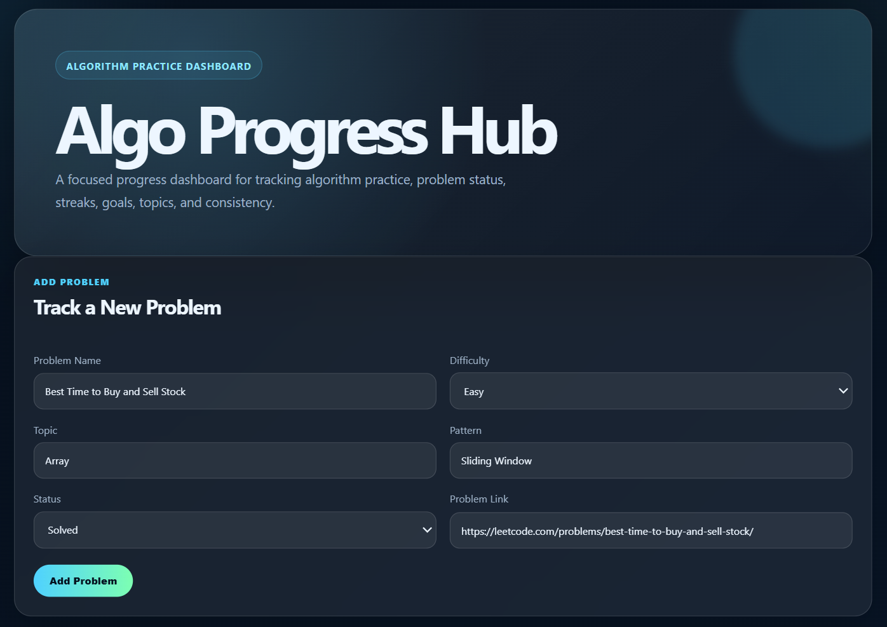
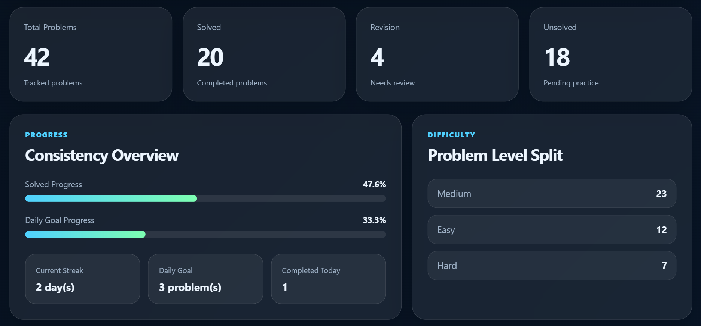
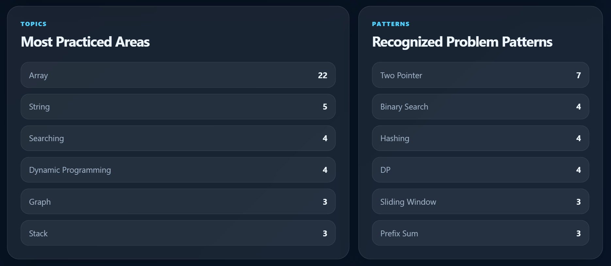
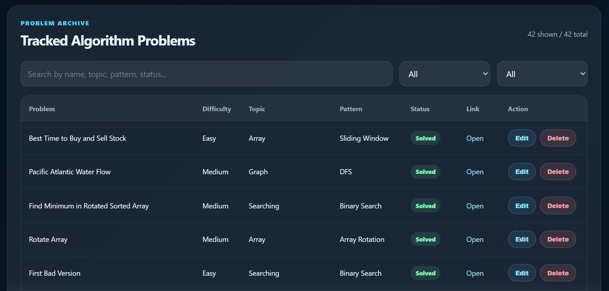
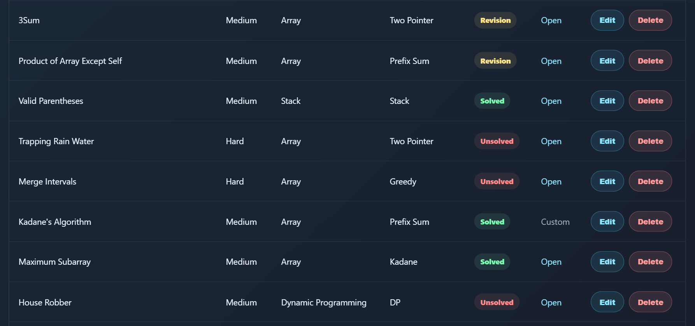
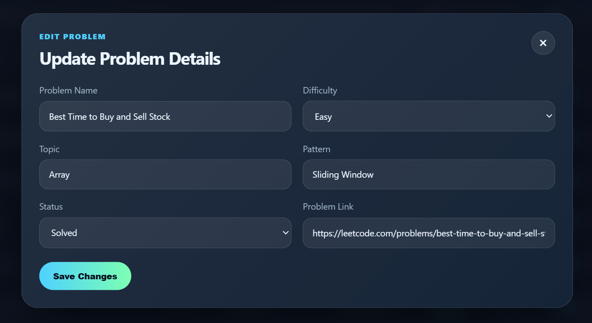
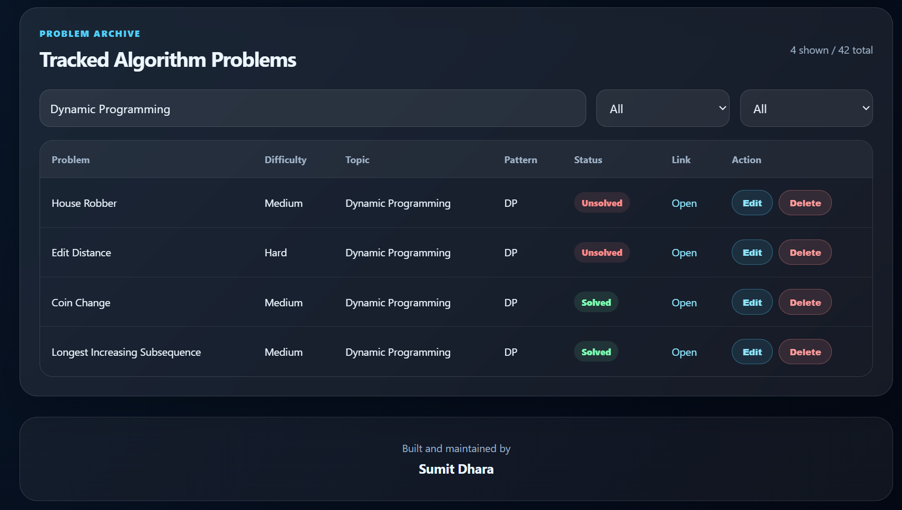

# 🚀 Algo Progress Hub

A personal algorithm-practice progress system built to turn DSA preparation into a structured, trackable, and consistent habit.

Originally started as a simple Python CLI tracker, **Algo Progress Hub** later evolved into a full web dashboard with analytics, search, filters, Supabase-backed storage, and a public read-only deployment.

**🌐 Live Demo:** https://algo-progress-hub.vercel.app/  
**📦 Repository:** https://github.com/sumitdhara609/algo-progress-hub

---

## 🖼️ Preview

### Dashboard Hero



### Add Problem Workflow



### Stats and Analytics



### Topic and Pattern Insights



### Problem Archive



### Edit Problem Workflow



### Search, Filter, and Public Footer



---

## 🌍 Overview

Most algorithm practice becomes scattered over time.

Problems are solved on different platforms, notes are kept in different places, and progress often becomes difficult to measure. Algo Progress Hub was built to solve that problem by creating one focused system for tracking:

- ✅ solved problems
- 🔁 revision problems
- ⏳ unsolved problems
- 📊 difficulty distribution
- 🧠 topic coverage
- 🧩 problem-solving patterns
- 🎯 daily goal progress
- 🔥 streak consistency

The project began as a small CLI utility and gradually became a more polished dashboard experience.

---

## 🧭 Development Story

Algo Progress Hub is personally meaningful because it was my first GitHub repository.

I started building the first version in early 2025 as a part-time personal tool to track my own DSA practice. The original version was a Python CLI app using JSON-based storage. I worked on it consistently for around two months, roughly 10 hours per week, for an estimated total of about 80 hours.

On **10 April 2026**, I pushed it to GitHub as my first public repository.

Later, I revisited the project and upgraded it from a basic CLI tracker into a web-based dashboard. Around **20 June 2026**, I connected Supabase and deployed the project on Vercel so the progress data could be displayed cleanly through a live public interface.

This project is not just about DSA tracking. It represents the beginning of my developer journey — the first system I built, improved, deployed, and shaped into something presentable.

---

## 🔒 Current Public Deployment

The live Vercel deployment is intentionally configured as a **read-only public dashboard**.

Public visitors can:

- 👀 view the dashboard
- 📈 explore statistics
- 🔍 search problems
- 🎚️ filter by difficulty
- 🏷️ filter by status
- 🔗 open available problem links

Public visitors cannot:

- ❌ add problems
- ❌ edit problems
- ❌ delete problems
- ❌ modify Supabase data

This keeps the public demo safe while still showing the product clearly.

The full add, edit, and delete workflows were implemented during development and are shown in the screenshot gallery.

---

## ✨ Features

### 📌 Problem Tracking

Each problem can be tracked with:

- problem name
- difficulty: Easy, Medium, Hard
- topic: Array, String, Graph, DP, etc.
- pattern: Two Pointer, Binary Search, Hashing, Sliding Window, etc.
- status: Solved, Revision, Unsolved
- problem link

---

### 📊 Dashboard Analytics

The dashboard provides a clear overview of practice progress:

- total tracked problems
- solved count
- revision count
- unsolved count
- solved percentage
- daily goal progress
- current streak
- completed problems for the day

---

### 🧠 Topic and Pattern Insights

Algo Progress Hub highlights the most practiced areas and recognized patterns, helping identify what has been practiced most and where more balance may be needed.

Examples:

- Array
- String
- Searching
- Dynamic Programming
- Graph
- Stack
- Two Pointer
- Binary Search
- Hashing
- Sliding Window
- Prefix Sum

---

### 🔍 Search and Filters

The problem archive supports fast exploration through:

- search by problem name
- search by topic
- search by pattern
- search by status
- filter by difficulty
- filter by status

This makes the dashboard useful even as the number of tracked problems grows.

---

### 🛠️ CRUD Workflow

The project includes a full problem-management workflow:

- add new problems
- edit existing problem details
- delete incorrect entries
- update statuses
- reflect progress in dashboard statistics

For public safety, these write operations are not exposed on the live read-only deployment.

---

## 🧰 Tech Stack

### Frontend

- Next.js
- React
- TypeScript
- CSS

### Backend and Data

- Supabase
- PostgreSQL
- Row Level Security policies

### Original Version

- Python
- JSON-based local storage
- Command Line Interface

### Deployment

- Vercel

---

## 🗓️ Timeline

| Date / Period | Milestone |
| --- | --- |
| Early 2025 | Started as a Python CLI-based DSA tracker |
| Early 2025 | Worked part-time for around 2 months |
| Approx. 80 hours | Estimated total build time for the first version |
| 10 April 2026 | Pushed to GitHub as my first public repository |
| June 2026 | Upgraded into a web dashboard |
| Around 20 June 2026 | Connected Supabase for persistent data |
| Around 20 June 2026 | Deployed publicly on Vercel |
| Final version | Public dashboard made read-only for safe sharing |

---

## ⚙️ How It Works

1. Problems are stored in Supabase.
2. The dashboard fetches problem, goal, and streak data.
3. Statistics are calculated from tracked problem records.
4. Search and filters run on the client side for a smooth browsing experience.
5. Public users can explore the dashboard without modifying data.
6. Write access is restricted for safety.

---

## 🐍 Original CLI Version

The first version of Algo Progress Hub was built as a Python command-line tool.

It supported:

- adding problems
- viewing a dashboard
- searching problems
- deleting problems
- viewing stats
- setting a daily goal
- tracking streaks

Example CLI flow:

```bash
Enter choice: 1  → Add Problem
Enter choice: 2  → View Dashboard
Enter choice: 3  → Search Problem
Enter choice: 4  → Delete Problem
Enter choice: 5  → View Stats
Enter choice: 6  → Set Daily Goal
Enter choice: 7  → Exit
````

The original data was stored in structured JSON format:

```json
{
  "name": "Trapping Rain Water",
  "difficulty": "Hard",
  "topic": "Array",
  "pattern": "Two Pointer",
  "status": "Unsolved",
  "link": "https://leetcode.com/problems/trapping-rain-water/"
}
```

---

## 🚀 Running Locally

### 1. Clone the repository

```bash
git clone https://github.com/sumitdhara609/algo-progress-hub.git
```

### 2. Navigate into the project

```bash
cd algo-progress-hub
```

### 3. Install dependencies

```bash
npm install
```

### 4. Create environment variables

Create a `.env.local` file:

```env
NEXT_PUBLIC_SUPABASE_URL=your_supabase_project_url
NEXT_PUBLIC_SUPABASE_ANON_KEY=your_supabase_anon_key
```

### 5. Run the development server

```bash
npm run dev
```

Open:

```bash
http://localhost:3000
```

---

## 🏗️ Build

```bash
npm run build
```

---

## 📁 Project Structure

```bash
algo-progress-hub/
├── app/
│   ├── globals.css
│   └── page.tsx
├── components/
│   ├── AddProblemForm.tsx
│   ├── EditProblemModal.tsx
│   ├── ProblemTable.tsx
│   ├── ProgressBar.tsx
│   └── StatCard.tsx
├── lib/
│   ├── progress.ts
│   └── supabase.ts
├── public/
│   └── screenshots/
├── scripts/
├── src/
├── data/
└── README.md
```

---

## 🛡️ Security Note

The public deployment is configured as a read-only dashboard.

Supabase Row Level Security is used so public visitors can read dashboard data but cannot directly modify production records through the live site.

This is intentional because the project is publicly shared as a portfolio/demo dashboard.

---

## 💙 Why This Project Matters

Algo Progress Hub started as a small personal tool.

At that time, the goal was simple: stay consistent with algorithm practice and stop losing track of solved problems.

But over time, it became more than that.

It became my first GitHub repository, my first structured developer project, my first step toward building systems instead of just writing isolated code.

The project reminds me that even a small CLI script can become something meaningful when it is improved patiently.

---

## 🔮 Future Improvements

Possible future upgrades:

* protected admin dashboard
* authentication-based editing
* chart-based analytics
* calendar heatmap
* LeetCode API integration
* export progress as CSV/JSON
* advanced pattern analysis
* goal history tracking

---

## 👤 Author & License

**Author:** Sumit Dhara

This project is open-source under the  **MIT License.**

#### © 2026 Sumit Dhara. All rights reserved.

---

## ⭐ If you found this useful, consider giving a star!